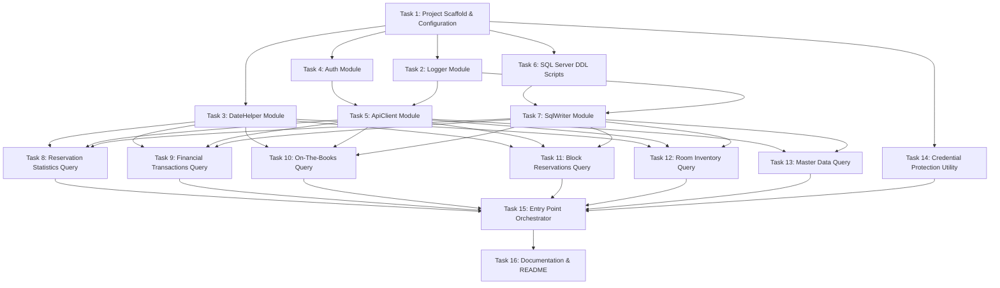

# Implementation Plan

## Overview

This document is the implementation plan for the **OPERA R&A Data Loader** — a PowerShell 7.x solution that extracts data from the Oracle OPERA Cloud Reporting & Analytics (R&A) API via OHIP, transforms it with hotel business-date and time-zone logic, and loads it into SQL Server for downstream reporting (Infor EPM / USALI).

The plan is organized into 16 sequential tasks covering project scaffolding, cross-cutting modules (logging, date/business-date handling, authentication, API client, SQL writer), the SQL Server schema, the six data-domain query modules (reservation statistics, financial transactions, on-the-books, block reservations, room inventory, master data), the credential-protection utility, the orchestrator entry point, and documentation.

All items are marked complete (`[x]`) and reflect the delivered state of the solution. Each task maps to concrete files under `Config\`, `Modules\`, `Modules\Queries\`, `SQL\`, `Tools\`, and the root orchestrator `Run-OperaRALoader.ps1`.

## Tasks

- [x] 1. Project Scaffold & Configuration
  - [x] 1.1 Create folder structure: `Config\`, `Modules\`, `Modules\Queries\`, `SQL\`, `Tools\`, `Logs\`
  - [x] 1.2 Create `Config\settings.json` with all global settings: SQL Server, API throttle, extraction horizons (`otbFutureDays`, `blockFutureDays`, `transactionalChunkDays`), logging (`logDirectory`, `logLevel`, `sqlLogging`, `logName` — a single shared log file for the whole run), and a shared SMTP transport block (`smtpServer`, `port`, `useSsl`, `from`, `enabled`, and DPAPI-encrypted `username`/`password`) — recipients are NOT global
  - [x] 1.3 Create `Config\hotels.sample.json` with two sample hotels across two different chains (plain text, no real credentials), including `otbFutureDays`, `blockFutureDays`, `nightAuditHour`, `timeZoneId`, and a per-hotel `emailAlerts` block (`enabled` + per-severity `to[]`/`cc[]` for INFO/WARN/ERROR)
  - [x] 1.4 Create `.gitignore` excluding `Config\hotels.json`, `Logs\`, `Config\hotels.input.json`

- [x] 2. Logger Module (`Modules\Logger.psm1`)
  - [x] 2.1 (REBUILD) Implement `Initialize-Logger` — called ONCE at startup by the orchestrator; sets `$script:LogFilePath` to the single shared file `{LogDirectory}\{yyyyMMdd}_{logName}.log` using `logging.logDirectory` + single `logging.logName` from `settings.json` (no per-query-type files); creates `LogDirectory` if absent; opens in append mode so re-runs on the same day accumulate in the same file
  - [x] 2.2 (REBUILD) Implement `Write-Log` with levels INFO / WARN / ERROR / DEBUG; format: `YYYY-MM-DD HH:mm:ss.fff [LEVEL] [HotelCode] [BatchId] Message`; writes to the single shared `$script:LogFilePath` (one common file for the whole run — orchestrator + all query modules)
  - [x] 2.3 Use a single shared log file for the entire run: `Initialize-Logger` is called once at startup by the orchestrator, and every module (orchestrator + all query modules) writes to the same `$script:LogFilePath`. Distinguish sources via the `[HotelCode]` / `[BatchId]` / `[LEVEL]` columns, not separate files
  - [x] 2.4 Log file directory and single log name read from `settings.json` `logging.logDirectory` and `logging.logName`; file name resolves to `{yyyyMMdd}_{logName}.log`
  - [x] 2.5 Implement `Start-Batch` returning a new `[guid]` BatchId; write initial `Running` row to `dbo.LoadLog`
  - [x] 2.6 Implement `Complete-Batch` updating `dbo.LoadLog` with final status, row counts, duration
  - [x] 2.7 Implement `Send-AlertEmail` via `Net.Mail.SmtpClient` using the shared SMTP transport from `settings.json` (server, port, from, useSsl, DPAPI-decrypted username/password); resolve recipients per hotel from `hotels.json` `emailAlerts.<severity>.to[]` / `cc[]`; send end-of-run summary only when `smtp.enabled` AND the hotel's `emailAlerts.enabled` AND that severity is enabled AND recipients exist; attach the daily log file; delivery failure logs WARN and never aborts the run (REQ-016)
  - [x] 2.8 Mask sensitive patterns (bearer tokens, secrets, API keys) with `****` in all log output
  - [x] 2.9 Support `-Verbose` and `-Debug` PowerShell switches via `$VerbosePreference` / `$DebugPreference`

- [x] 3. DateHelper Module (`Modules\DateHelper.psm1`)
  - [x] 3.1 Implement `Get-BusinessDate` — resolves hotel local yesterday accounting for `nightAuditHour` and `timeZoneId`
  - [x] 3.2 Implement `Convert-ToUtc` and `Convert-ToLocal` using `[TimeZoneInfo]::FindSystemTimeZoneById`
  - [x] 3.3 Implement `Format-OutputDate` (date-only → `YYYYMMDD`) and `Format-OutputDateTime` (datetime → `YYYYMMDD HH:mm:ss`); empty/null → empty string. Used by RES/OTB/FIN output. Note: does NOT apply to GraphQL API request filters, which keep ISO `YYYY-MM-DD`
  - [x] 3.4 Implement `Get-DateRangeChunks` — splits a date range into chunks of N days (configurable, default 7 for transactional data)
  - [x] 3.5 Implement `Get-SnapshotHorizon` — returns `SnapshotDate`, `ConsideredDateStart`, `ConsideredDateEnd` based on hotel `otbFutureDays` / `blockFutureDays`
  - [x] 3.6 Cover edge cases: DST transition nights, `nightAuditHour = 0` (midnight), missing config fallback to 00:00

- [x] 4. Auth Module (`Modules\Auth.psm1`)
  - [x] 4.1 Implement in-memory token cache `$script:TokenCache` keyed by `HotelCode`
  - [x] 4.2 Implement `Get-OAuthToken` — POST `/oauth/token` with `client_credentials` grant; parse `access_token` + `expires_in`
  - [x] 4.3 Implement token expiry check: `ExpiresAt > (Now + SafetyMarginSeconds)`
  - [x] 4.4 Implement `Clear-TokenCache -HotelCode` for forced refresh on 401
  - [x] 4.5 Decrypt `ClientId` and `ClientSecret` from DPAPI-encrypted config before use; never log either value

- [x] 5. ApiClient Module (`Modules\ApiClient.psm1`)
  - [x] 5.1 Implement `Invoke-RAApi` with header injection: `Authorization: Bearer`, `x-app-key`, `x-hotelid`, `Content-Type: application/json`
  - [x] 5.2 Implement HTTP 401 handler: `Clear-TokenCache` → `Get-OAuthToken` → retry once
  - [x] 5.3 Implement retry with exponential backoff on 429 / 500 / 502 / 503 / 504 (base 2 s, ×2 per attempt, cap 30 s, max 3 retries)
  - [x] 5.4 Implement pagination loop consuming `nextPageToken` or offset-based paging; collect all pages into single result array
  - [x] 5.5 Implement per-request throttle: `Start-Sleep -Milliseconds $config.api.requestDelayMs` between page calls
  - [x] 5.6 Return normalised `[array]` of `[PSCustomObject]` with consistent field names

- [x] 6. SQL Server DDL Scripts (`SQL\`)
  - [x] 6.1 `SQL\001_CreateSchema.sql` — create schema `ra` with `IF NOT EXISTS` guard
  - [x] 6.2 `SQL\002_CreateTables_Actuals.sql` — `dbo.LoadLog`, `ra.ReservationStats`, `ra.FinancialTx`
    - `ra.ReservationStats` natural key: `HotelCode + BusinessDate + ReservationId + MarketSegment + RoomTypeLabel`
    - `ra.FinancialTx` natural key: `HotelCode + BusinessDate + ReservationId + FolioNo + TrxCode + PostingDate + Amount`; `IsLatePosting BIT DEFAULT 0`; `PostingDateLocal` + `PostingDateUtc`
  - [x] 6.3 `SQL\003_CreateTables_Snapshots.sql` — `ra.OnTheBooks`, `ra.BlockReservations`, `ra.RoomInventory`
    - OTB natural key: `HotelCode + SnapshotDate + ConsideredDate + MarketSegment + RoomTypeLabel + ReservationSource + Channel`
    - Block natural key: `HotelCode + SnapshotDate + BlockCode + ConsideredDate + RoomTypeLabel`; `IsPastCutoff BIT DEFAULT 0`
    - Inventory natural key: `HotelCode + InventoryDate + RoomTypeLabel`
  - [x] 6.4 `SQL\004_CreateTables_MasterData.sql` — `ra.TrxCodes`, `ra.RoomTypeLabels`, `ra.MarketSegments`, `ra.RateCodes`, `ra.ReservationSources`, `ra.Channels`, `ra.Hotels`
    - All master tables include SCD Type 2 columns: `ValidFrom DATE NOT NULL`, `ValidTo DATE NULL`, `IsCurrent BIT NOT NULL DEFAULT 1`
    - `ra.TrxCodes` includes: `TrxGroup`, `TrxType`, `RevenueYN`, `IncludedInRoomRevenueYN`, `IncludedInPackageYN`
    - `ra.RoomTypeLabels` includes: `RoomClass`, `PhysicalRoomCount`
    - `ra.RateCodes` includes: `RateCategory`
    - `ra.MarketSegments` includes: `SegmentGroup`
  - [x] 6.5 `SQL\005_CreateIndexes.sql` — indexes on `HotelCode`, `BusinessDate`/`SnapshotDate`/`ConsideredDate`/`InventoryDate`, `BatchId`, `ReservationId`, `TrxCode`, `IsCurrent`

- [x] 7. SqlWriter Module (`Modules\SqlWriter.psm1`)
  - [x] 7.1 Implement `Initialize-Database` — execute DDL scripts 001–005 idempotently on startup
  - [x] 7.2 Implement `Write-ReservationStats` — `SqlBulkCopy` to staging → `MERGE` into `ra.ReservationStats` on natural key
  - [x] 7.3 Implement `Write-FinancialTx` — `SqlBulkCopy` to staging → `MERGE` into `ra.FinancialTx`; compute `IsLatePosting` during mapping
  - [x] 7.4 Implement `Write-OnTheBooks` — `SqlBulkCopy` to staging → `MERGE` into `ra.OnTheBooks` (insert new `SnapshotDate` rows; do not overwrite prior snapshots)
  - [x] 7.5 Implement `Write-BlockReservations` — `SqlBulkCopy` to staging → `MERGE` into `ra.BlockReservations`; set `IsPastCutoff` where `CutoffDate < SnapshotDate`
  - [x] 7.6 Implement `Write-RoomInventory` — `SqlBulkCopy` to staging → `MERGE` into `ra.RoomInventory` on natural key
  - [x] 7.7 Implement `Write-MasterData` — SCD Type 2 MERGE for all seven master tables:
    - On change detected: `UPDATE` existing record (`ValidTo = today - 1`, `IsCurrent = 0`), `INSERT` new version row
    - On no change: no-op (skip update to avoid unnecessary churn)
    - On new code: `INSERT` with `ValidFrom = today`, `ValidTo = NULL`, `IsCurrent = 1`
  - [x] 7.8 Implement `Write-LoadLog` — insert initial `Running` row and update on completion

- [x] 8. Reservation Statistics Query (`Modules\Queries\ReservationStats.psm1`)
  - [x] 8.1 Implement `Get-ReservationStats -Hotel -StartDate -EndDate`
  - [x] 8.2 Build R&A API request body for the reservation statistics endpoint; apply date chunking via `Get-DateRangeChunks`
  - [x] 8.3 Map API response fields to flat `[PSCustomObject]` matching `ra.ReservationStats` schema including `ReservationId`, `MarketSegment`, `RoomTypeLabel`, `ReservationSource`, `Channel`
  - [x] 8.4 Format output date fields with `Format-OutputDate` / `Format-OutputDateTime`: date-only (`BUSINESS_DATE`, `TRUNC_BEGIN_DATE`, `TRUNC_END_DATE`) → `YYYYMMDD`; datetime (`CANCELLATION_DATE`) → `YYYYMMDD HH:mm:ss`
  - [x] 8.5 Compute `ADR` and `RevPAR` if not returned directly by API (`ADR = Revenue / RoomNights`; `RevPAR = Revenue / PhysicalRooms`)
  - [x] 8.6 Log row count and duration per date chunk per hotel

- [x] 9. Financial Transactions Query (`Modules\Queries\FinancialTransactions.psm1`)
  - [x] 9.1 Implement `Get-FinancialTransactions -Hotel -StartDate -EndDate`
  - [x] 9.2 Build R&A API request body for the financial/folio transactions endpoint; apply date chunking
  - [x] 9.3 Map API response to flat `[PSCustomObject]` matching `ra.FinancialTx` schema including `ReservationId`, `TrxCode`, `TrxType`, `PostingDate`
  - [x] 9.4 Populate `PostingDateLocal` (hotel TZ) and `PostingDateUtc` using `Convert-ToUtc`
  - [x] 9.5 Format output date fields with the DateHelper formatters: date-only (`BUSINESS_DATE`) → `YYYYMMDD`; datetime (`TRX_DATE`, `TRX_DATE_UTC`) → `YYYYMMDD HH:mm:ss`
  - [x] 9.6 Set `IsLatePosting = 1` where `PostingDate > BusinessDate`; log WARN with count if any late postings found

- [x] 10. On-The-Books Query (`Modules\Queries\OnTheBooks.psm1`)
  - [x] 10.1 Implement `Get-OnTheBooks -Hotel -SnapshotDate -FutureDays`
  - [x] 10.2 Use `Get-SnapshotHorizon` to build `ConsideredDateStart` / `ConsideredDateEnd` range
  - [x] 10.3 Build R&A API request body for OTB endpoint
  - [x] 10.4 Map response fields to `ra.OnTheBooks` schema: `SnapshotDate`, `ConsideredDate`, `MarketSegment`, `RoomTypeLabel`, `ReservationSource`, `Channel`, `RoomsOnBooks`, `TentativeRooms`, `DefiniteRooms`, `ADROnBooks`, `RevenueOnBooks`
  - [x] 10.5 Format output date fields with `Format-OutputDate`: date-only (`SNAPSHOT_DATE`, `CONSIDERED_DATE`, `TRUNC_BEGIN_DATE`, `TRUNC_END_DATE`) → `YYYYMMDD`
  - [x] 10.6 Log snapshot date, considered date range, and row count

- [x] 11. Block Reservations Query (`Modules\Queries\BlockReservations.psm1`)
  - [x] 11.1 Implement `Get-BlockReservations -Hotel -SnapshotDate -FutureDays`
  - [x] 11.2 Build R&A API request body for group block endpoint
  - [x] 11.3 Map response to `ra.BlockReservations` schema: `SnapshotDate`, `ConsideredDate`, `BlockCode`, `BlockName`, `RoomTypeLabel`, `MarketSegment`, `RoomsContracted`, `RoomsPickedUp`, `RoomsRemaining`, `CutoffDate`
  - [x] 11.4 Compute `IsPastCutoff = 1` where `CutoffDate < SnapshotDate`; log WARN count if any

- [x] 12. Room Inventory Query (`Modules\Queries\RoomInventory.psm1`)
  - [x] 12.1 Implement `Get-RoomInventory -Hotel -StartDate -EndDate`
  - [x] 12.2 Build R&A API request for room inventory / availability endpoint
  - [x] 12.3 Map response to `ra.RoomInventory` schema: `InventoryDate`, `RoomTypeLabel`, `PhysicalRooms`, `OutOfOrder`, `OutOfService`
  - [x] 12.4 Compute `AvailableRooms = PhysicalRooms - OutOfOrder - OutOfService` if not returned by API
  - [x] 12.5 Support both historical (actuals) and future (forecast) date ranges in a single call

- [x] 13. Master Data Query (`Modules\Queries\MasterData.psm1`)
  - [x] 13.1 Implement `Get-MasterData -Hotel -Type -ChangedSince`; `-Type` accepts: `TrxCodes`, `RoomTypeLabels`, `RateCodes`, `MarketCodes`, `SourceCodes` (source of reservation — PRIORITY/required), `Channels` (distribution channel — OPTIONAL), `Hotels`. `SourceCodes` and `Channels` are two independent code lists and MUST NOT be merged
  - [x] 13.2 Implement full refresh mode (no `-ChangedSince`) and delta mode (pass `ChangedSince` filter to API)
  - [x] 13.3 Map `TrxCodes` response: `TrxCode`, `TrxName`, `TrxGroup`, `TrxType`, `RevenueYN`, `IncludedInRoomRevenueYN`, `IncludedInPackageYN`, `IsActive`
  - [x] 13.4 Map `RoomTypeLabels` response: `RoomTypeLabel`, `Description`, `RoomClass`, `PhysicalRoomCount`, `IsActive`
  - [x] 13.5 Map `MarketCodes` (market segment) from `ExportMappings` to `ra.DIM_MarketCodes`: `Code`, `Description`, `SegmentGroup`, `IsActive`
  - [x] 13.6 Map `RateCodes`: `Code`, `Description`, `RateCategory`, `IsActive`
  - [x] 13.7 Map `SourceCodes` (source of reservation, OPERA `SOURCE_CODE`) from `ExportMappings` to `ra.DIM_SourceCodes`: `Code`, `Description`, `IsActive` — PRIORITY / required dimension, always loaded; a missing source list is treated as an error
  - [x] 13.8 Map `Channels` (distribution channel, OPERA `CHANNEL` — e.g. GDS/OTA/Direct/Web/CRO) from `ExportMappings` to `ra.DIM_Channels`: `Code`, `Description`, `IsActive`; keep as a separate list from `SourceCodes` — OPTIONAL / best-effort: skip WITHOUT failing the run (log INFO/WARN) if the channel list is unavailable or absent
  - [x] 13.9 Detect and log changes between current DB records and API response (new codes, description changes, deactivations)

- [x] 14. Credential Protection Utility (`Tools\Protect-HotelsConfig.ps1`)
  - [x] 14.1 Read plain-text `Config\hotels.input.json` (never committed to source control)
  - [x] 14.2 Encrypt `clientId`, `clientSecret`, `apiKey` per hotel, and the shared `smtp.username`/`smtp.password` in `settings.json`, using `ConvertTo-SecureString` with DPAPI
  - [x] 14.3 Write encrypted values to `Config\hotels.json`; copy all other fields unchanged
  - [x] 14.4 Verify round-trip decryption for each value before writing; abort on mismatch
  - [x] 14.5 Add usage comment header to script with instructions for service account setup

- [x] 15. Entry Point Orchestrator (`Run-OperaRALoader.ps1`)
  - [x] 15.1 Declare all parameters: `-Mode`, `-HotelCode`, `-ChainCode`, `-BusinessDate`, `-StartDate`, `-EndDate`, `-DryRun`, `-FailFast`, `-ConfigPath`
  - [x] 15.2 Load and validate `settings.json` and `hotels.json` at startup; fail fast on missing required fields
  - [x] 15.3 Decrypt hotel credentials (DPAPI); validate decryption before proceeding
  - [x] 15.4 Filter hotel list by `-HotelCode` / `-ChainCode` when specified
  - [x] 15.5 Call `Initialize-Database` when `-Mode Full` or on first run (no schema present)
  - [x] 15.6 Per-hotel execution loop:
    - `Start-Batch` → `Get-OAuthToken`
    - Based on `-Mode`: call relevant query modules in order: MasterData → ReservationStats → FinancialTx → OTB → BlockReservations → RoomInventory
    - Respect `-DryRun`: skip all `Write-*` calls, log `[DRYRUN]` prefix
    - Catch per-hotel errors: log ERROR + `Complete-Batch` with `Error` status; continue unless `-FailFast`
  - [x] 15.7 Output summary table to console on completion: Hotel | Status | Rows | Duration
  - [x] 15.8 Set `exit` code: 0 = all success, 1 = partial failure, 2 = total failure

- [x] 16. Documentation & README (`README.md`)
  - [x] 16.1 Prerequisites: PowerShell 7.x, SQL Server, network access to OPERA Cloud R&A API
  - [x] 16.2 Installation steps: clone, run `Protect-HotelsConfig.ps1`, configure `settings.json`
  - [x] 16.3 Scheduling guidance: Windows Task Scheduler XML template and SQL Agent job example
  - [x] 16.4 Full parameter reference table for `Run-OperaRALoader.ps1`
  - [x] 16.5 SQL schema overview with entity relationship notes (RES ↔ FIN via `BusinessDate + ReservationId`; OTB/Block `SnapshotDate + ConsideredDate` pattern)
  - [x] 16.6 Troubleshooting section: token errors, late postings, SCD2 rollback procedure
  - [x] 16.7 Add `# GenAI-generated code — reviewed and approved by: <name> <date>` header to all `.ps1` / `.psm1` files per Infor policy
  - [x] 16.8 Document exit codes and monitoring integration guidance

## Task Dependency Graph

The graph below shows execution order and dependencies. Foundation tasks (scaffold, cross-cutting modules, DDL) must complete before the domain query modules and orchestrator.



The following JSON encodes the same dependency graph as parallel execution waves. Each wave lists the tasks whose dependencies are fully satisfied by prior waves, so all tasks within a wave may be executed concurrently.

```json
{
  "waves": [
    {
      "wave": 1,
      "tasks": ["T1"],
      "description": "Project scaffold & configuration — root prerequisite for all work"
    },
    {
      "wave": 2,
      "tasks": ["T2", "T3", "T4", "T6", "T14"],
      "description": "Independent foundations built directly on the scaffold: Logger, DateHelper, Auth, SQL DDL scripts, and the Credential Protection utility"
    },
    {
      "wave": 3,
      "tasks": ["T5", "T7"],
      "description": "ApiClient (depends on Auth + Logger) and SqlWriter (depends on DDL + Logger)"
    },
    {
      "wave": 4,
      "tasks": ["T8", "T9", "T10", "T11", "T12", "T13"],
      "description": "Domain query modules — each depends on ApiClient and SqlWriter (T8–T12 also depend on DateHelper; T13 does not)"
    },
    {
      "wave": 5,
      "tasks": ["T15"],
      "description": "Entry point orchestrator — integrates all query modules plus the credential utility"
    },
    {
      "wave": 6,
      "tasks": ["T16"],
      "description": "Documentation & README — finalized after orchestrator behavior is settled"
    }
  ],
  "edges": [
    { "from": "T1", "to": "T2" },
    { "from": "T1", "to": "T3" },
    { "from": "T1", "to": "T4" },
    { "from": "T1", "to": "T6" },
    { "from": "T1", "to": "T14" },
    { "from": "T4", "to": "T5" },
    { "from": "T2", "to": "T5" },
    { "from": "T6", "to": "T7" },
    { "from": "T2", "to": "T7" },
    { "from": "T3", "to": "T8" },
    { "from": "T5", "to": "T8" },
    { "from": "T7", "to": "T8" },
    { "from": "T3", "to": "T9" },
    { "from": "T5", "to": "T9" },
    { "from": "T7", "to": "T9" },
    { "from": "T3", "to": "T10" },
    { "from": "T5", "to": "T10" },
    { "from": "T7", "to": "T10" },
    { "from": "T3", "to": "T11" },
    { "from": "T5", "to": "T11" },
    { "from": "T7", "to": "T11" },
    { "from": "T3", "to": "T12" },
    { "from": "T5", "to": "T12" },
    { "from": "T7", "to": "T12" },
    { "from": "T5", "to": "T13" },
    { "from": "T7", "to": "T13" },
    { "from": "T8", "to": "T15" },
    { "from": "T9", "to": "T15" },
    { "from": "T10", "to": "T15" },
    { "from": "T11", "to": "T15" },
    { "from": "T12", "to": "T15" },
    { "from": "T13", "to": "T15" },
    { "from": "T14", "to": "T15" },
    { "from": "T15", "to": "T16" }
  ]
}
```

Dependency summary:

- **Task 1 (Scaffold)** is the root; all folder/config work precedes everything else.
- **Tasks 2–4 (Logger, DateHelper, Auth)** are independent cross-cutting foundations built on the scaffold.
- **Task 5 (ApiClient)** depends on Auth (token injection/refresh) and Logger (masked request logging).
- **Task 6 (DDL)** depends only on the scaffold; **Task 7 (SqlWriter)** depends on the DDL and Logger.
- **Tasks 8–13 (domain queries)** each depend on DateHelper, ApiClient, and SqlWriter. Task 13 (Master Data) does not require DateHelper.
- **Task 14 (Credential utility)** depends only on the scaffold and is a prerequisite for running the orchestrator.
- **Task 15 (Orchestrator)** integrates all query modules plus the credential utility.
- **Task 16 (Documentation)** is finalized last, after the orchestrator behavior is settled.

## Notes

- **GenAI attribution (Infor policy):** All `.ps1` / `.psm1` files carry a `# GenAI-generated code — reviewed and approved by: <name> <date>` header. This code is GenAI-generated and requires human review before production use.
- **Business-date logic:** Extraction relies on per-hotel `nightAuditHour` and `timeZoneId` to resolve the correct local business date; DST transitions and midnight (`nightAuditHour = 0`) are handled explicitly in `DateHelper`.
- **Late postings:** Financial transactions where `PostingDate > BusinessDate` are flagged (`IsLatePosting = 1`) and logged at WARN so downstream reconciliation can account for them.
- **Missing / fallback source data:** `SourceCodes` (source of reservation) is a required dimension — a missing list is treated as an error. `Channels` (distribution channel) is optional/best-effort — its absence logs INFO/WARN and does not fail the run. `SourceCodes` and `Channels` are kept as two independent code lists and are never merged.
- **Time-zone handling:** API request filters use ISO `YYYY-MM-DD`; output date fields use `YYYYMMDD` / `YYYYMMDD HH:mm:ss` via the DateHelper formatters. Financial transactions persist both `PostingDateLocal` (hotel TZ) and `PostingDateUtc`.
- **Security:** Credentials (`clientId`, `clientSecret`, `apiKey`) and SMTP `username`/`password` are DPAPI-encrypted via `Protect-HotelsConfig.ps1`; plain-text `hotels.input.json` is never committed. Bearer tokens, secrets, and API keys are masked with `****` in all log output.
- **Rate limits & batching:** The ApiClient applies a configurable per-request throttle and exponential backoff on 429/5xx responses. Transactional data is chunked (default 7 days) to bound request size and respect API limits.
- **Idempotency:** SQL writes use staging + `MERGE` on natural keys; master data uses SCD Type 2 versioning so historical values are preserved rather than overwritten.
- **Logging:** A single shared daily log file (`{yyyyMMdd}_{logName}.log`) is used for the entire run; sources are distinguished by the `[HotelCode]` / `[BatchId]` / `[LEVEL]` columns. Alert email delivery failures log WARN and never abort the run.
